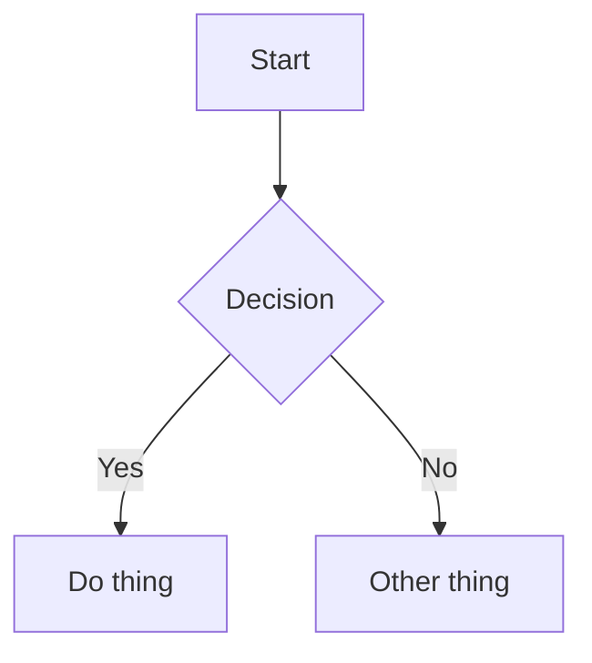

# Presenterm Slide Generation

Generate `.md` files for [presenterm](https://github.com/mfontanini/presenterm), a terminal-based slideshow tool.

## When to Activate

User asks to create slides, a presentation, a talk, or a deck — or mentions presenterm by name.

## File Structure

A presenterm file is standard Markdown with YAML front matter and HTML comment directives.

```markdown
---
title: My Talk
sub_title: Optional subtitle
author: Name
theme:
  override:
    code:
      theme_name: base16-ocean.dark
      background: true
      padding:
        horizontal: 2
        vertical: 1
---

# First Slide Title

Content here.

<!-- end_slide -->

# Second Slide

More content.
```

## Slide Separation

- `<!-- end_slide -->` — explicit slide break (preferred)
- `---` — also works as a slide separator (but conflicts with front matter, so use `end_slide`)
- `# Heading` — starts a new slide automatically

## Comment Commands Reference

Place these as HTML comments anywhere in a slide:

```
<!-- pause -->                          # Progressive reveal — content below appears on next advance
<!-- end_slide -->                      # End current slide
<!-- jump_to_middle -->                 # Vertically center remaining content
<!-- new_line -->                       # Insert blank line
<!-- new_lines: 5 -->                   # Insert N blank lines
<!-- font_size: 2 -->                   # Font size 1–7
<!-- incremental_lists: true -->        # Each bullet appears on advance
<!-- incremental_lists: false -->       # Disable incremental lists
<!-- column_layout: [1, 2, 1] -->       # Define column proportions
<!-- column: 0 -->                      # Switch to column by index
<!-- reset_layout -->                   # Return to full width
<!-- alignment: center -->              # Text alignment: left | center | right
<!-- no_footer -->                      # Hide footer on this slide
<!-- skip_slide -->                     # Exclude slide from presentation
<!-- include: other-file.md -->         # Include external markdown file
<!-- speaker_note: text here -->        # Speaker note (single line)
<!-- // This is a comment -->           # Ignored comment
```

Multiline speaker note:
```markdown
<!--
speaker_note: |
  Line one of the note.
  Line two of the note.
-->
```

## Code Blocks

### Basic syntax highlighting

````markdown
```python
def hello():
    print("world")
```
````

### Modifiers (append after language name)

- `+line_numbers` — show line numbers
- `+exec` — make executable (user presses Ctrl-E to run live)
- `+render` — render output as image (for mermaid, latex, typst)

Combine modifiers: `` ```python +line_numbers +exec ``

### Dynamic highlighting (step-through)

Curly braces after language define highlight steps, separated by `|`:

````markdown
```rust {1-3|5-7|9-11} +line_numbers
// Step 1: highlighted first
struct Config {
    verbose: bool,
}

// Step 2: highlighted second
impl Config {
    fn new() -> Self {
        // Step 3: highlighted third
        Config { verbose: false }
    }
}
```
````

Single lines and ranges can mix: `{1|3-5|7}`

### Executable code

````markdown
```bash +exec
echo "Runs live in the terminal"
```

```python +exec
print("Also runs live")
```
````

Hidden lines (executed but not displayed): prefix with `#` in rust, `///` in python.

## Mermaid Diagrams

Requires `mermaid-cli` (`mmdc`) installed.

````markdown

````

## LaTeX / Typst Formulas

Requires `typst` installed.

````markdown
```latex +render
\[ E = mc^2 \]
```

```typst +render
$f(x) = x^2 + 1$
```
````

## Column Layouts

```markdown
<!-- column_layout: [1, 1] -->

<!-- column: 0 -->
Left column content.

<!-- column: 1 -->
Right column content.

<!-- reset_layout -->

Full-width content again.
```

Numbers in the array are proportional widths (e.g., `[2, 1]` = 2/3 + 1/3).

## Images

```markdown

```

Works in terminals with kitty, iTerm2, or sixel protocol support.

## Speaker Notes

Viewed by running two instances:

```bash
# Presentation screen
presenterm slides.md --publish-speaker-notes

# Notes screen (your laptop)
presenterm slides.md --listen-speaker-notes
```

## User Preferences

- **Linux terminal:** kitty (image protocol: auto-detected)
- **Windows terminal:** Windows Terminal with sixel support
  - May need `defaults.image_protocol: sixel` in presenterm config if auto-detect fails
- **Code theme:** `base16-ocean.dark` (default preference — ask user if they want different)
- **Mermaid:** installed via `pacman -S mermaid-cli` on Arch/Manjaro

## Tips for Generating Good Slides

1. Keep slides concise — terminal real estate is limited (~80–120 cols)
2. Use `<!-- pause -->` to build up complex ideas step by step
3. Use `<!-- incremental_lists: true -->` for bullet-heavy slides
4. Use dynamic code highlighting `{lines}` when walking through code
5. Use column layouts for code + explanation side by side
6. Add `+exec` to code that would benefit from live demo
7. Add speaker notes for talking points the audience shouldn't see
8. Always include front matter with title, author, and code theme
9. Use `<!-- jump_to_middle -->` for title/closing slides for visual impact
